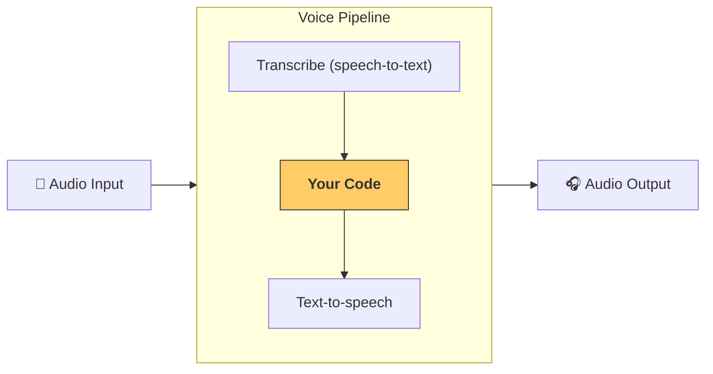

---
search:
  exclude: true
---
# パイプラインとワークフロー

[`VoicePipeline`][agents.voice.pipeline.VoicePipeline] は、エージェント的なワークフローを音声アプリへ簡単に変換できるクラスです。実行したいワークフローを渡すだけで、入力音声の文字起こし、音声終了の検出、適切なタイミングでのワークフロー呼び出し、そしてワークフロー出力の音声化までをパイプラインが自動で処理します。



## パイプラインの設定

パイプラインを作成する際に設定できる項目は次のとおりです。

1. [`workflow`][agents.voice.workflow.VoiceWorkflowBase]  
   新しい音声が文字起こしされるたびに実行されるコードです。
2. [`speech-to-text`][agents.voice.model.STTModel] と [`text-to-speech`][agents.voice.model.TTSModel] のモデル
3. [`config`][agents.voice.pipeline_config.VoicePipelineConfig]  
   以下のような内容を設定できます。  
    - モデルプロバイダー：モデル名をモデルにマッピングします  
    - トレーシング：トレーシングの無効化、音声ファイルのアップロード有無、ワークフロー名、トレース ID など  
    - TTS および STT モデルの設定：プロンプト、言語、データ型など

## パイプラインの実行

パイプラインは [`run()`][agents.voice.pipeline.VoicePipeline.run] メソッドで実行できます。音声入力は 2 つの形式で渡せます。

1. [`AudioInput`][agents.voice.input.AudioInput]  
   完全な音声トランスクリプトが既にある場合に使用し、そのトランスクリプトに対する結果だけを生成します。事前録音された音声やプッシュトゥトーク方式でユーザーの発話終了が明確な場合に便利です。  
2. [`StreamedAudioInput`][agents.voice.input.StreamedAudioInput]  
   ユーザーが話し終えたタイミングを検出する必要がある場合に使用します。音声チャンクを検出次第プッシュでき、パイプラインが「アクティビティ検出」により適切なタイミングでワークフローを自動実行します。

## 結果

音声パイプラインの実行結果は [`StreamedAudioResult`][agents.voice.result.StreamedAudioResult] です。このオブジェクトを通じてイベントをストリーミングで受け取れます。イベントの種類は次のとおりです。

1. [`VoiceStreamEventAudio`][agents.voice.events.VoiceStreamEventAudio]：音声チャンクを含みます。  
2. [`VoiceStreamEventLifecycle`][agents.voice.events.VoiceStreamEventLifecycle]：ターン開始・終了などのライフサイクルイベントを通知します。  
3. [`VoiceStreamEventError`][agents.voice.events.VoiceStreamEventError]：エラーイベントです。  

```python

result = await pipeline.run(input)

async for event in result.stream():
    if event.type == "voice_stream_event_audio":
        # play audio
    elif event.type == "voice_stream_event_lifecycle":
        # lifecycle
    elif event.type == "voice_stream_event_error"
        # error
    ...
```

## ベストプラクティス

### 割り込み

Agents SDK には現在、[`StreamedAudioInput`][agents.voice.input.StreamedAudioInput] に対する組み込みの割り込み機能はありません。検出された各ターンごとにワークフローが個別に実行されます。アプリケーション内で割り込みを扱いたい場合は [`VoiceStreamEventLifecycle`][agents.voice.events.VoiceStreamEventLifecycle] イベントを監視してください。`turn_started` は新しいターンが文字起こしされ処理が開始されたことを示し、`turn_ended` は該当ターンの音声がすべて配信された後に発火します。これらのイベントを利用して、モデルがターンを開始した際に話者のマイクをミュートし、関連音声の送信が完了した後にアンミュートする、といった制御が可能です。