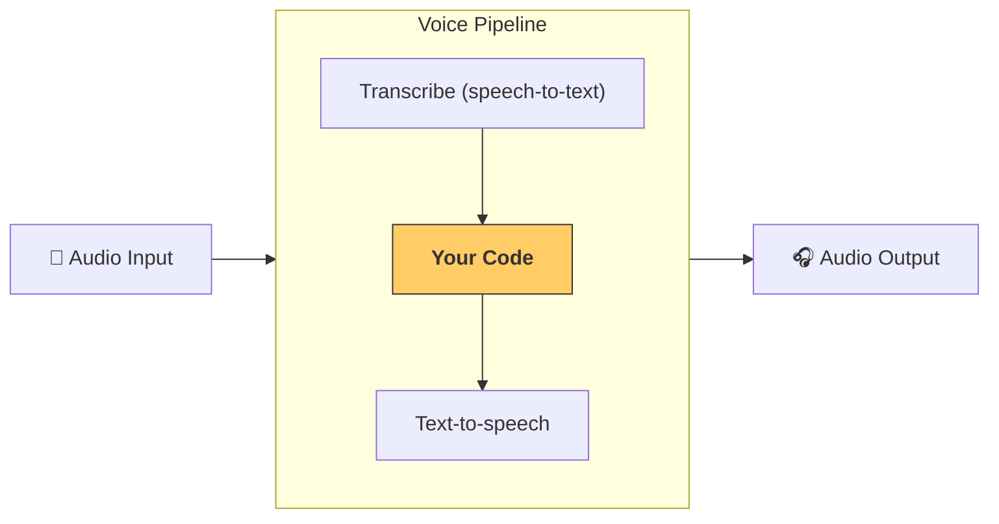

---
search:
  exclude: true
---
# パイプラインとワークフロー

[`VoicePipeline`][agents.voice.pipeline.VoicePipeline] は、エージェントワークフローを音声アプリに簡単に変換できるクラスです。ワークフローを渡すだけで、音声入力の文字起こし、音声終了の検出、適切なタイミングでのワークフロー呼び出し、そしてワークフロー出力を音声へ戻す処理を自動で行います。



## パイプラインの設定

パイプラインを作成する際に次の項目を設定できます。

1. [`workflow`][agents.voice.workflow.VoiceWorkflowBase] — 新しい音声が文字起こしされるたびに実行されるコード  
2. 使用する [`speech-to-text`][agents.voice.model.STTModel] と [`text-to-speech`][agents.voice.model.TTSModel] モデル  
3. [`config`][agents.voice.pipeline_config.VoicePipelineConfig] — 以下のような内容を設定できます  
    - モデルプロバイダー：モデル名をモデルにマッピング  
    - トレーシング：トレーシングの有効 / 無効、音声ファイルのアップロード可否、ワークフロー名、トレース ID など  
    - TTS および STT モデルの設定：プロンプト、言語、使用するデータ型 など

## パイプラインの実行

パイプラインは [`run()`][agents.voice.pipeline.VoicePipeline.run] メソッドで実行できます。音声入力は次の 2 つの形式で渡せます。

1. [`AudioInput`][agents.voice.input.AudioInput] — 完全な音声トランスクリプトがある場合に使用し、その内容に対して結果を生成します。発話が終了したタイミングを検出する必要がないケース（例：事前収録音声や push-to-talk アプリでユーザーが話し終えるタイミングが明確な場合）で便利です。  
2. [`StreamedAudioInput`][agents.voice.input.StreamedAudioInput] — ユーザーの発話終了を検出する必要がある場合に使用します。検出された音声チャンクをプッシュでき、 VoicePipeline がアクティビティ検出と呼ばれるプロセスを介して適切なタイミングでエージェントワークフローを自動実行します。

## 結果

VoicePipeline 実行結果は [`StreamedAudioResult`][agents.voice.result.StreamedAudioResult] です。このオブジェクトでは、発生するイベントをストリームで受け取れます。以下のような複数種類の [`VoiceStreamEvent`][agents.voice.events.VoiceStreamEvent] があります。

1. [`VoiceStreamEventAudio`][agents.voice.events.VoiceStreamEventAudio] — 音声チャンクを含みます。  
2. [`VoiceStreamEventLifecycle`][agents.voice.events.VoiceStreamEventLifecycle] — ターンの開始・終了などライフサイクルイベントを通知します。  
3. [`VoiceStreamEventError`][agents.voice.events.VoiceStreamEventError] — エラーイベントです。

```python

result = await pipeline.run(input)

async for event in result.stream():
    if event.type == "voice_stream_event_audio":
        # play audio
    elif event.type == "voice_stream_event_lifecycle":
        # lifecycle
    elif event.type == "voice_stream_event_error"
        # error
    ...
```

## ベストプラクティス

### 割り込み

Agents SDK は現在 [`StreamedAudioInput`][agents.voice.input.StreamedAudioInput] に対して組み込みの割り込み処理をサポートしていません。検出された各ターンごとにワークフローの個別実行がトリガーされます。アプリケーション内で割り込みを扱いたい場合は [`VoiceStreamEventLifecycle`][agents.voice.events.VoiceStreamEventLifecycle] イベントを監視してください。`turn_started` は新しいターンが文字起こしされ処理が開始されたことを示します。`turn_ended` は該当ターンのすべての音声がディスパッチされた後に発火します。これらのイベントを使い、モデルがターンを開始した際にスピーカーのマイクをミュートし、そのターンに関連する音声をすべて出力し終えたあとでアンミュートする、といった制御が可能です。