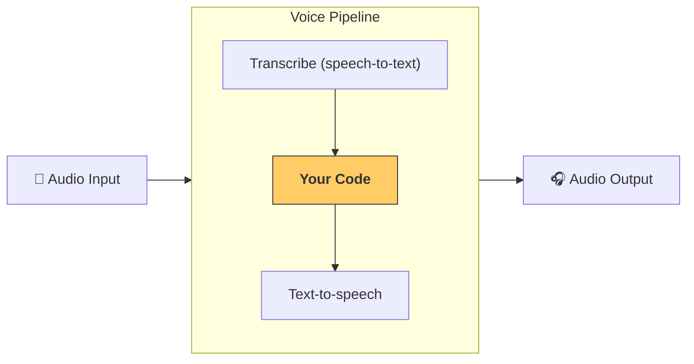

---
search:
  exclude: true
---
# 流水线与工作流

[`VoicePipeline`][agents.voice.pipeline.VoicePipeline] 是一个类，可将你的智能体工作流轻松构建为语音应用。你传入要运行的工作流，流水线会负责转写输入音频、检测音频结束时间点、在合适的时机调用你的工作流，并将工作流输出转换回音频。



## 配置流水线

创建流水线时，你可以设置以下内容：

1. [`workflow`][agents.voice.workflow.VoiceWorkflowBase]：每次转写出新音频时运行的代码。
2. 使用的 [`speech-to-text`][agents.voice.model.STTModel] 和 [`text-to-speech`][agents.voice.model.TTSModel] 模型。
3. [`config`][agents.voice.pipeline_config.VoicePipelineConfig]：用于配置例如：
    - 模型提供器，可将模型名称映射到模型
    - 追踪，包括是否禁用追踪、是否上传音频文件、工作流名称、追踪 ID 等
    - TTS 与 STT 模型的设置，例如 prompt、语言和使用的数据类型

## 运行流水线

你可以通过 [`run()`][agents.voice.pipeline.VoicePipeline.run] 方法运行流水线，它允许你以两种形式传入音频输入：

1. [`AudioInput`][agents.voice.input.AudioInput]：当你已有完整音频转写，只想为其生成结果时使用。这在无需检测说话者何时结束的场景很有用；例如，使用预录音频，或在按键说话（push-to-talk）应用中用户何时说完是明确的。
2. [`StreamedAudioInput`][agents.voice.input.StreamedAudioInput]：当你可能需要检测用户何时说完时使用。它允许你在检测到音频块时逐步推送，语音流水线会在合适的时机自动运行智能体工作流，该过程称为“活动检测（activity detection）”。

## 结果

语音流水线运行的结果是一个 [`StreamedAudioResult`][agents.voice.result.StreamedAudioResult]。该对象允许你在事件发生时进行流式接收。存在几种 [`VoiceStreamEvent`][agents.voice.events.VoiceStreamEvent] 类型，包括：

1. [`VoiceStreamEventAudio`][agents.voice.events.VoiceStreamEventAudio]，包含一段音频数据。
2. [`VoiceStreamEventLifecycle`][agents.voice.events.VoiceStreamEventLifecycle]，通知诸如回合开始或结束等生命周期事件。
3. [`VoiceStreamEventError`][agents.voice.events.VoiceStreamEventError]，错误事件。

```python

result = await pipeline.run(input)

async for event in result.stream():
    if event.type == "voice_stream_event_audio":
        # play audio
    elif event.type == "voice_stream_event_lifecycle":
        # lifecycle
    elif event.type == "voice_stream_event_error"
        # error
    ...
```

## 最佳实践

### 打断处理

Agents SDK 目前尚不支持对 [`StreamedAudioInput`][agents.voice.input.StreamedAudioInput] 的内置打断处理。对于每个检测到的回合，都会单独触发一次你的工作流运行。如果你希望在应用内处理打断，可以监听 [`VoiceStreamEventLifecycle`][agents.voice.events.VoiceStreamEventLifecycle] 事件。`turn_started` 表示新的回合已被转写且处理开始；`turn_ended` 会在相应回合的所有音频分发完成后触发。你可以利用这些事件在模型开始一个回合时静音说话者的麦克风，并在你刷新完该回合的所有相关音频后取消静音。