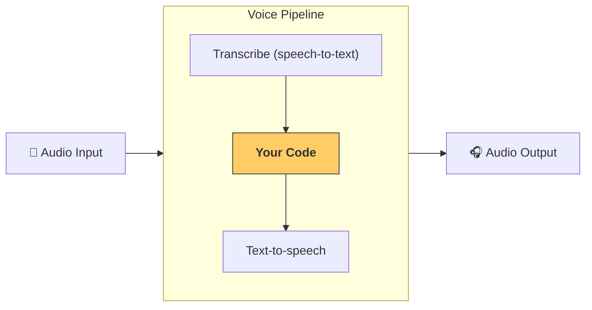

---
search:
  exclude: true
---
# 流水线与工作流

[`VoicePipeline`][agents.voice.pipeline.VoicePipeline] 是一个可将你的智能体工作流轻松变成语音应用的类。你传入要运行的工作流，流水线会负责转录输入音频、检测音频结束的时机、在合适的时刻调用你的工作流，并将工作流输出转换回音频。



## 配置流水线

创建流水线时，你可以设置以下内容：

1. [`workflow`][agents.voice.workflow.VoiceWorkflowBase]：每次有新音频被转录时运行的代码。
2. 使用的 [`speech-to-text`][agents.voice.model.STTModel] 和 [`text-to-speech`][agents.voice.model.TTSModel] 模型。
3. [`config`][agents.voice.pipeline_config.VoicePipelineConfig]：用于配置如下内容：
    - 模型提供方，可将模型名称映射到具体模型
    - 追踪，包括是否禁用追踪、是否上传音频文件、工作流名称、追踪 ID 等
    - TTS 和 STT 模型的设置，如提示词、语言和使用的数据类型

## 运行流水线

你可以通过 [`run()`][agents.voice.pipeline.VoicePipeline.run] 方法运行流水线，并以两种形式传入音频输入：

1. [`AudioInput`][agents.voice.input.AudioInput]：当你已经拥有完整的音频转录，仅需对其生成结果时使用。适用于不需要检测说话者何时结束的场景；例如，已有预先录制的音频，或在按键说话（push-to-talk）应用中能明确知道用户已说完。
2. [`StreamedAudioInput`][agents.voice.input.StreamedAudioInput]：当你可能需要检测用户何时说完时使用。它允许你在检测到音频片段时即时推送，语音流水线会通过称为“activity detection”的过程，在恰当的时机自动运行智能体工作流。

## 结果

语音流水线运行的结果是一个 [`StreamedAudioResult`][agents.voice.result.StreamedAudioResult]。这是一个可在事件发生时进行流式传输的对象。[`VoiceStreamEvent`][agents.voice.events.VoiceStreamEvent] 包括几类事件：

1. [`VoiceStreamEventAudio`][agents.voice.events.VoiceStreamEventAudio]，包含一段音频数据。
2. [`VoiceStreamEventLifecycle`][agents.voice.events.VoiceStreamEventLifecycle]，用于告知诸如轮次开始或结束等生命周期事件。
3. [`VoiceStreamEventError`][agents.voice.events.VoiceStreamEventError]，表示错误事件。

```python

result = await pipeline.run(input)

async for event in result.stream():
    if event.type == "voice_stream_event_audio":
        # play audio
    elif event.type == "voice_stream_event_lifecycle":
        # lifecycle
    elif event.type == "voice_stream_event_error"
        # error
    ...
```

## 最佳实践

### 中断

Agents SDK 目前不为 [`StreamedAudioInput`][agents.voice.input.StreamedAudioInput] 提供任何内置的中断支持。相反，它会在每次检测到的轮次上触发你工作流的单独一次运行。如果你希望在应用内处理中断，可以监听 [`VoiceStreamEventLifecycle`][agents.voice.events.VoiceStreamEventLifecycle] 事件。`turn_started` 表示一个新轮次已被转录且处理开始；`turn_ended` 会在对应轮次的所有音频都已分发后触发。你可以利用这些事件在模型开始一个轮次时静音说话者的麦克风，并在清空该轮次相关的音频后取消静音。