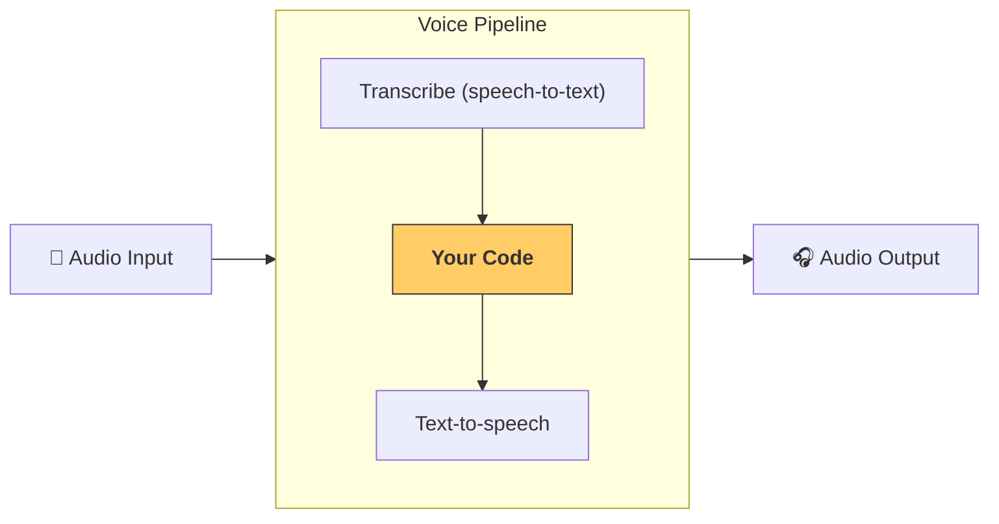

---
search:
  exclude: true
---
# 流水线与工作流

[`VoicePipeline`][agents.voice.pipeline.VoicePipeline] 是一个类，可帮助你轻松将智能体工作流变成语音应用。你传入要运行的工作流，流水线会负责转写输入音频、检测音频何时结束、在合适的时机调用你的工作流，并把工作流的输出再转换为音频。



## 配置流水线

创建流水线时，你可以设置以下内容：

1. [`workflow`][agents.voice.workflow.VoiceWorkflowBase]：每次有新的音频被转写时运行的代码。
2. 使用的 [`speech-to-text`][agents.voice.model.STTModel] 和 [`text-to-speech`][agents.voice.model.TTSModel] 模型。
3. [`config`][agents.voice.pipeline_config.VoicePipelineConfig]：用于配置以下内容，例如：
    - 模型提供方，可将模型名称映射到具体模型
    - 追踪，包括是否禁用追踪、是否上传音频文件、工作流名称、追踪 ID 等
    - TTS 和 STT 模型的设置，如使用的 prompt、语言和数据类型等

## 运行流水线

你可以通过 [`run()`][agents.voice.pipeline.VoicePipeline.run] 方法运行流水线，该方法允许以两种形式传入音频输入：

1. [`AudioInput`][agents.voice.input.AudioInput]：当你已有完整音频且只想为其生成结果时使用。在不需要检测说话者何时结束的场景很有用；例如，预录音频，或在按键说话应用中，用户何时说完是明确的。
2. [`StreamedAudioInput`][agents.voice.input.StreamedAudioInput]：当你可能需要检测用户何时说完时使用。它允许你在检测到音频片段时逐块推送，语音流水线会通过“活动检测”在恰当的时机自动运行智能体工作流。

## 结果

语音流水线运行的结果是一个 [`StreamedAudioResult`][agents.voice.result.StreamedAudioResult]。这是一个对象，可让你在事件发生时进行流式消费。存在几种 [`VoiceStreamEvent`][agents.voice.events.VoiceStreamEvent]，包括：

1. [`VoiceStreamEventAudio`][agents.voice.events.VoiceStreamEventAudio]：包含一段音频数据。
2. [`VoiceStreamEventLifecycle`][agents.voice.events.VoiceStreamEventLifecycle]：通知你如一次轮次开始或结束等生命周期事件。
3. [`VoiceStreamEventError`][agents.voice.events.VoiceStreamEventError]：错误事件。

```python

result = await pipeline.run(input)

async for event in result.stream():
    if event.type == "voice_stream_event_audio":
        # play audio
    elif event.type == "voice_stream_event_lifecycle":
        # lifecycle
    elif event.type == "voice_stream_event_error"
        # error
    ...
```

## 最佳实践

### 打断

Agents SDK 目前不支持对 [`StreamedAudioInput`][agents.voice.input.StreamedAudioInput] 的内建打断处理。相反，对于每个检测到的轮次，它都会触发一次独立的工作流运行。如果你希望在应用内处理打断，可以监听 [`VoiceStreamEventLifecycle`][agents.voice.events.VoiceStreamEventLifecycle] 事件。`turn_started` 表示一个新轮次已被转写并开始处理。`turn_ended` 会在相应轮次的所有音频派发完毕后触发。你可以利用这些事件在模型开始一个轮次时静音说话者的麦克风，并在你为该轮次的相关音频全部输出后再取消静音。