```mermaid
graph LR
    %% Input
    A["🎤 Audio Input"]

    %% Voice Pipeline
    subgraph Voice_Pipeline [Voice Pipeline]
        direction TB
        B["Transcribe (speech-to-text)"]
        C["Your Code"]:::highlight
        D["Text-to-speech"]
        B --> C --> D
    end

    %% Output
    E["🎧 Audio Output"]

    %% Flow
    A --> Voice_Pipeline
    Voice_Pipeline --> E

    %% Custom styling
    classDef highlight fill:#ffcc66,stroke:#333,stroke-width:1px,font-weight:700;

```

---
search:
  exclude: true
---
# 管道与工作流

[`VoicePipeline`][agents.voice.pipeline.VoicePipeline] 是一个类，可轻松将你的智能体工作流变成语音应用。你传入要运行的工作流，管道会负责转写输入音频、检测音频何时结束、在合适的时机调用你的工作流，并将工作流输出重新转换为音频。



## 管道配置

创建管道时，你可以设置以下内容：

1. [`workflow`][agents.voice.workflow.VoiceWorkflowBase]：即每次有新音频被转写时运行的代码。
2. 使用的 [`speech-to-text`][agents.voice.model.STTModel] 和 [`text-to-speech`][agents.voice.model.TTSModel] 模型
3. [`config`][agents.voice.pipeline_config.VoicePipelineConfig]：用于配置如下内容：
    - 模型提供者，可将模型名称映射到具体模型
    - 追踪，包括是否禁用追踪、是否上传音频文件、工作流名称、追踪 ID 等
    - TTS 与 STT 模型的设置，如 prompt、语言和所用数据类型

## 运行管道

你可以通过 [`run()`][agents.voice.pipeline.VoicePipeline.run] 方法运行管道，它允许以两种形式传入音频输入：

1. [`AudioInput`][agents.voice.input.AudioInput]：当你已有完整音频并仅需为其生成结果时使用。在无需检测说话者何时结束的场景下很有用；例如，预先录制的音频，或在“按下说话”的应用中用户结束说话的时机很明确。
2. [`StreamedAudioInput`][agents.voice.input.StreamedAudioInput]：当可能需要检测用户何时说完时使用。它允许你在检测到时推送音频分片，语音管道会通过称为“语音活动检测 (activity detection)”的过程，在合适的时机自动运行智能体工作流。

## 结果

一次语音管道运行的结果是 [`StreamedAudioResult`][agents.voice.result.StreamedAudioResult]。该对象可让你在事件发生时进行流式接收。存在几种 [`VoiceStreamEvent`][agents.voice.events.VoiceStreamEvent] 类型，包括：

1. [`VoiceStreamEventAudio`][agents.voice.events.VoiceStreamEventAudio]：包含一段音频分片。
2. [`VoiceStreamEventLifecycle`][agents.voice.events.VoiceStreamEventLifecycle]：通知你如轮次开始或结束等生命周期事件。
3. [`VoiceStreamEventError`][agents.voice.events.VoiceStreamEventError]：错误事件。

```python

result = await pipeline.run(input)

async for event in result.stream():
    if event.type == "voice_stream_event_audio":
        # play audio
    elif event.type == "voice_stream_event_lifecycle":
        # lifecycle
    elif event.type == "voice_stream_event_error"
        # error
    ...
```

## 最佳实践

### 中断

Agents SDK 目前不对 [`StreamedAudioInput`][agents.voice.input.StreamedAudioInput] 提供任何内建的中断支持。相反，对于每个检测到的轮次，它都会触发一次单独的工作流运行。如果你希望在应用内处理中断，可以监听 [`VoiceStreamEventLifecycle`][agents.voice.events.VoiceStreamEventLifecycle] 事件。`turn_started` 表示一个新轮次已被转写且处理开始；`turn_ended` 则会在相应轮次的全部音频分发完成后触发。你可以利用这些事件在模型开始一个轮次时将说话者的麦克风静音，并在为该轮次发送完所有相关音频后取消静音。