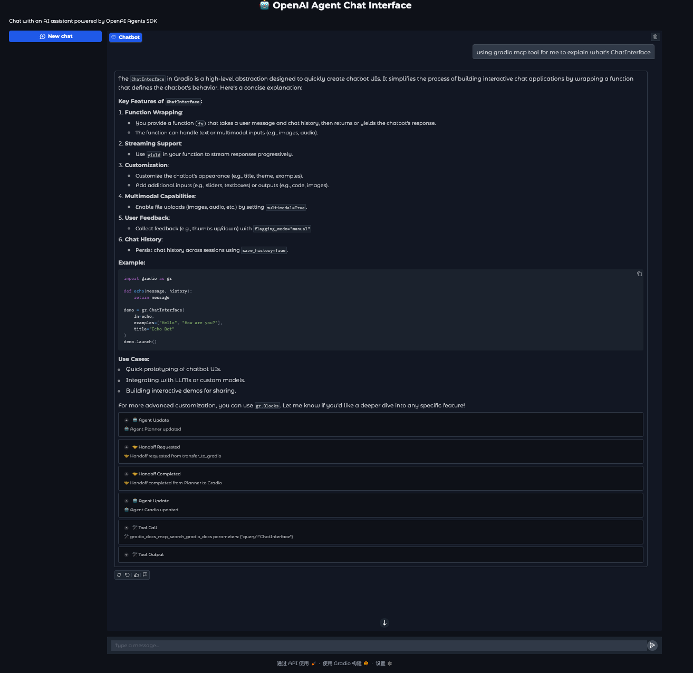

# Streaming Agent Gradio Example

This example demonstrates how to create a streaming agent interface using Gradio.

Run the example via:

```
uv run --dev python examples/gradio_example/main.py
```

## Details

This example shows how to integrate streaming agents with Gradio's chat interface, allowing real-time conversation with AI agents through a web UI.

This demo snapshow is showed below:



We using EventHandler to process each stream event and show a ChatMessage with metadata to explain the current process part of agent.